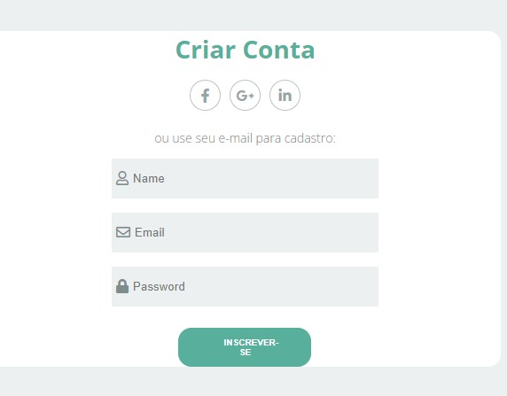

  

<h1 align="center">Website com tela de login</h1> 

Tabela de conteúdos
=================
<!--ts-->
   * [Sobre](#Sobre)
   * [Tabela de Conteudo](#tabela-de-conteudo)
   * [Instalação](#instalacao)
   * [Como usar](#como-usar)
      * [Pre Requisitos](#pre-requisitos)
   * [Tecnologias](#tecnologias)
<!--te-->

<h4 align="center"> 
	🚧  Em desenvolvimento.  🚧
</h4>

## Sobre

 

## Tabela de conteudo

- [ ] 
- [ ] 

## Como usar

  -

## Pre requisitos

-

## Tecnologias

-